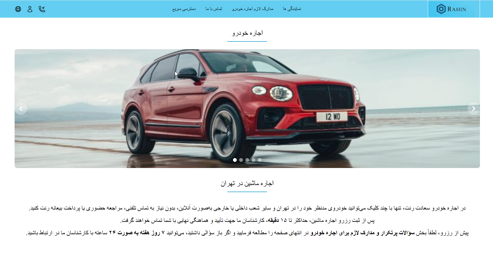
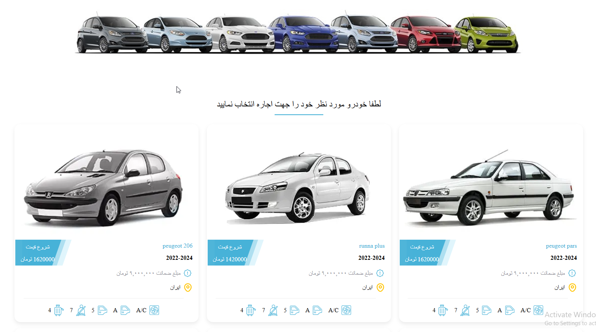
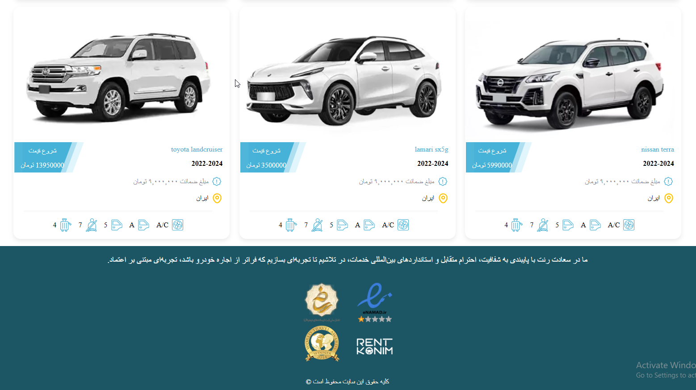
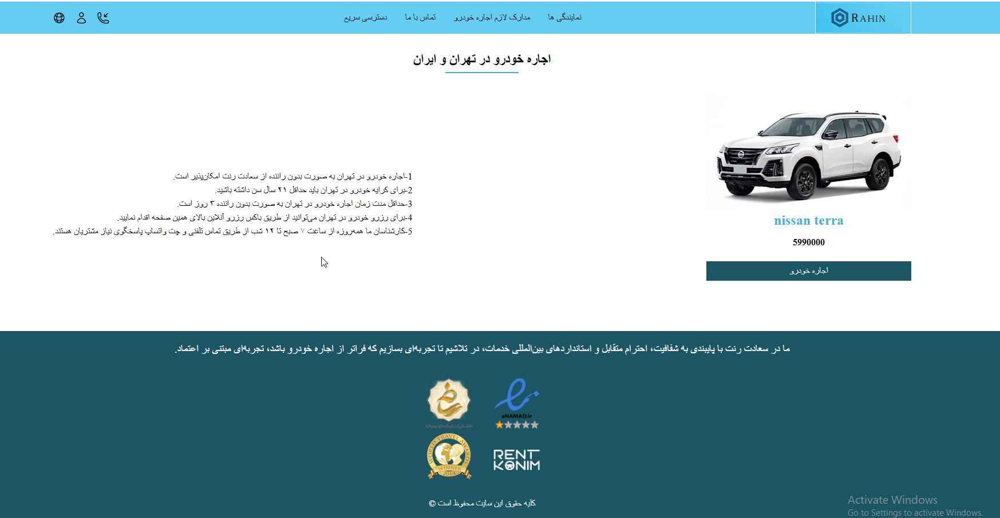
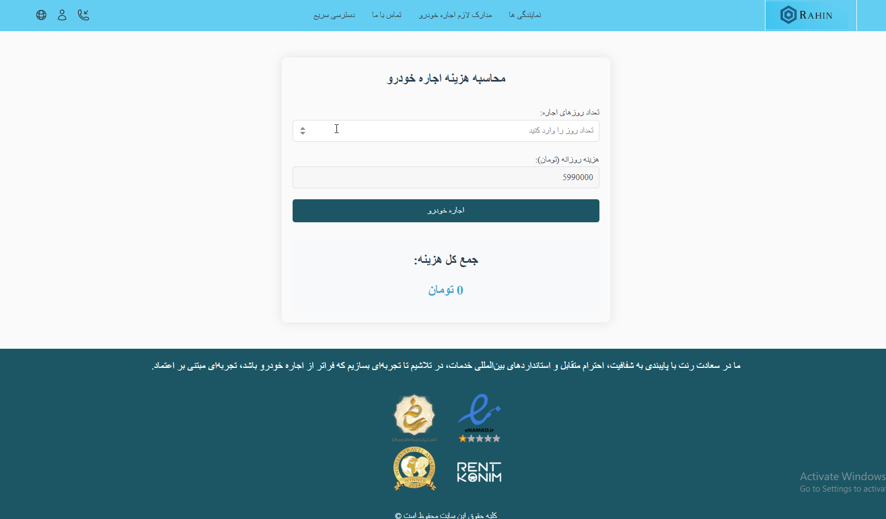
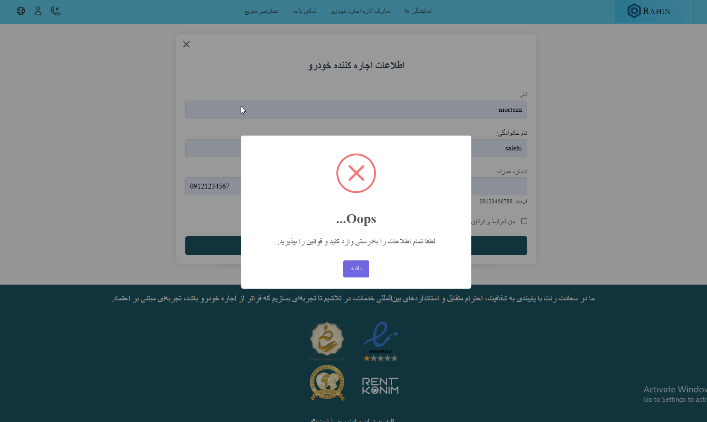
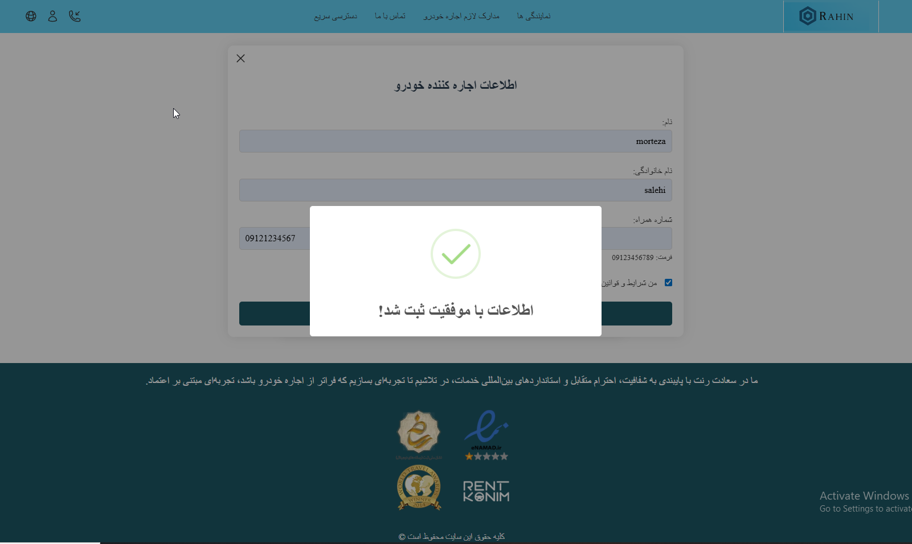
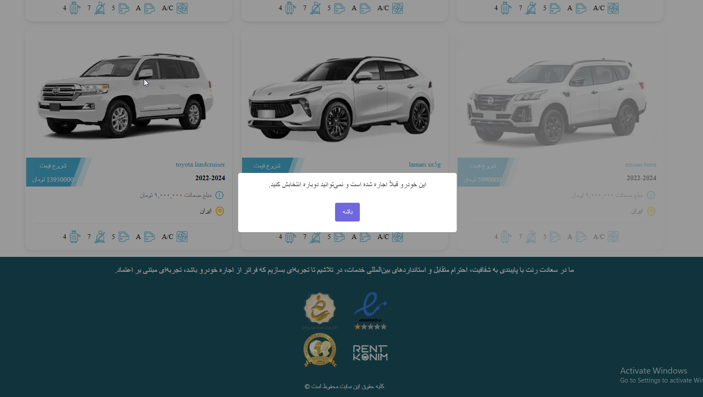

# Car Rental Project

This is a simple car rental website project with Persian content translated into English.

## Features

- Browse and select cars for rent.
- Online reservation without phone calls or in-person visits.
- 24/7 support.
- Confirmation within 15 minutes.

## Installation

1. Clone the repository or download the project files.

2. Open `index.html` in your web browser.

## Screenshots

Here are some screenshots of the project:

  

  

  

  

  

  

  

  

*(Place your screenshot images in the `screenshots` folder with names like `1.png`, `2.png`, etc.)*

## Usage

- Select your desired car.
- Register your reservation.
- Wait for confirmation from our team.

## Contact

For any inquiries, contact our support team available 24/7.
